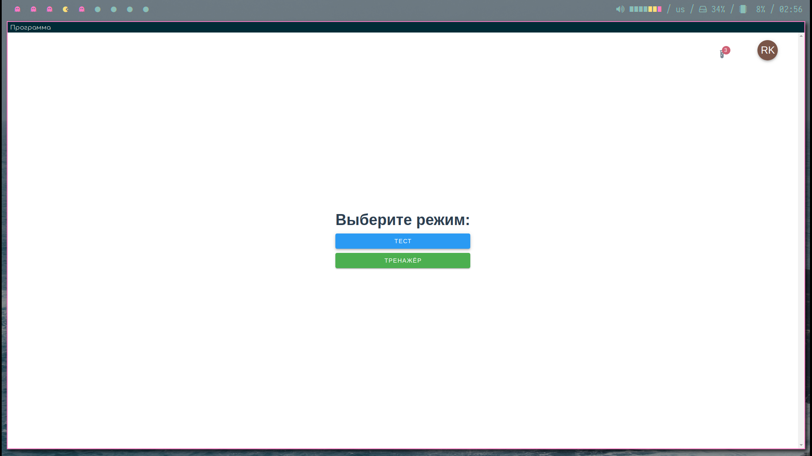

# CriminalQuiz education testing and trainer




## Get Started

### 1. clone this repository

```bash
git clone https://github.com/Alex-Taf/criminalquiz.git
```

### 2. install packages

```bash
yarn install
```
## Run

### dev mode

```bash
yarn app:dev  
```

### preview mode

```bash
yarn app:preview  
```

### build app

```bash
yarn app:build
```

### debug main process

1. Add a break point in the main process `src/electron/main/main.ts`.
2. Open the `Run and Debug (Ctrl+Shift+D)` tool, and select `Debug Main Process`.
*Note: Before using the debug tool to debug the main process, you should run the preview script `npm run app:preview` first to build the Vue app.*